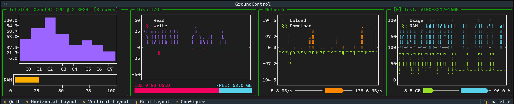
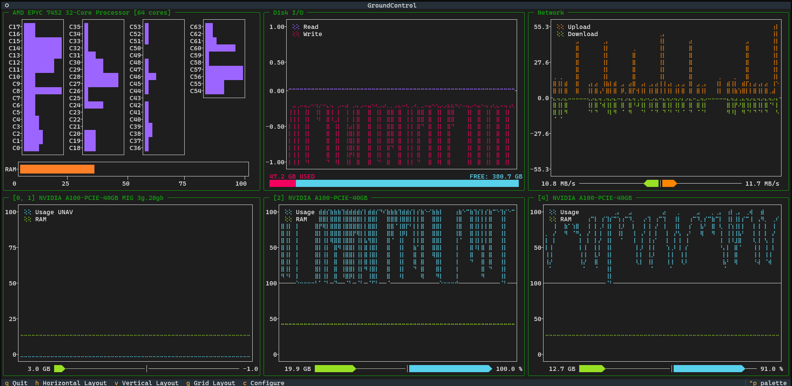
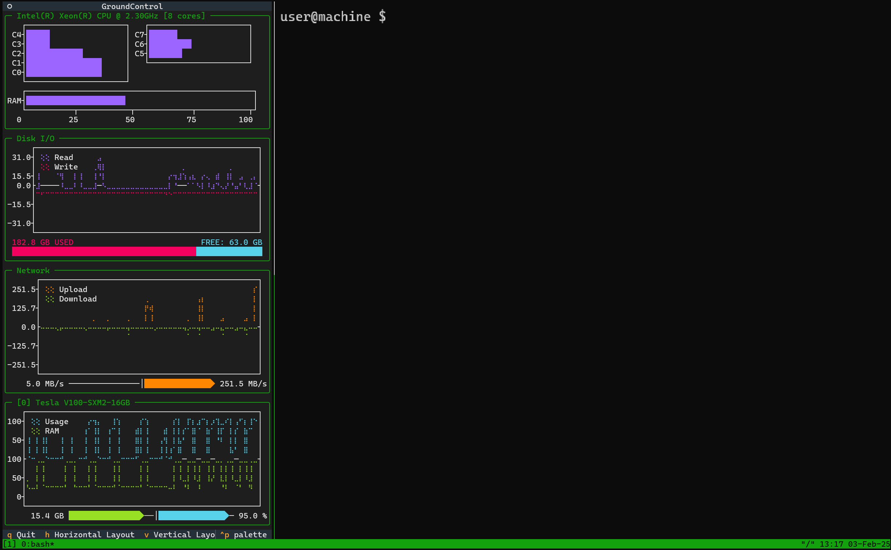

# 🚀 Ground Control - The Ultimate Terminal System Monitor



[](https://badge.fury.io/py/ground-control-tui)
[](https://www.gnu.org/licenses/gpl-3.0)
[](https://www.python.org/downloads/)

**Ground Control** is a sleek, real-time terminal-based system monitor built with [Textual](https://textual.textualize.io/), [Plotext](https://github.com/piccolomo/plotext) and the [nvitop API](https://terminaltrove.com/nvitop/). It provides a powerful, aesthetic, customizable interface for tracking CPU, memory, disk, network, and GPU usage — all in a visually appealing and responsive TUI.

## 🌟 Features

### 📊 Real-Time System Monitoring
- **CPU Usage**: Per-core load tracking with frequency stats.
- **Memory Utilization**: RAM usage with dynamic visualization.
- **Disk I/O**: Monitor read/write speeds and disk usage.
- **Network Traffic**: Live upload/download speeds.
- **GPU Metrics**: Real-time NVIDIA GPU monitoring (if available).

### 🖥️ Responsive Layout
- **Automatic resizing** to fit your terminal window.
- **Multiple layouts**: Grid, Horizontal, and Vertical.
- **Customizable widgets**: Show only the metrics you need.

### 🎛️ Interactive Controls
- **Keyboard shortcuts** for quick navigation.
- **Toggle between different layouts** instantly.
- **Customize displayed metrics** via a built-in selection panel.

---

## 🛠️ Installation

### 🔹 Install via PyPI
```sh
pip install ground-control-tui
```

### 🔹 Install from Source
```sh
git clone https://github.com/alberto-rota/ground-control
cd ground-control
pip install -e .
```

---

## 🚀 Getting Started

### 🔹 Run Ground Control
Once installed, simply launch Ground Control with:
```sh
groundcontrol
```

Or run as a Python module:
```sh
python -m ground_control
```

### 🔹 Keyboard Shortcuts

| Key  | Action |
|------|--------|
| `q`  | Quit application |
| `h`  | Switch to Horizontal Layout |
| `v`  | Switch to Vertical Layout |
| `g`  | Switch to Grid Layout |
| `c`  | Configure displayed widgets |

### 🔹 Available Layouts

#### Grid Layout (Default)
A structured layout displaying all widgets neatly.


#### Horizontal Layout
All widgets aligned in a single row.


#### Vertical Layout
A column-based layout, ideal for narrow terminals.


---

## 🖥️ Widget Breakdown
Each panel in Ground Control represents a different system metric:

### 🔹 **CPU & Memory**
- Shows real-time per-core CPU usage.
- Displays RAM usage with a visual bar.

### 🔹 **Disk I/O**
- Monitors read/write speeds.
- Displays disk usage in an easy-to-read format.

### 🔹 **Network Traffic**
- Tracks real-time upload/download speeds.
- Visualizes network activity.

### 🔹 **GPU Metrics (NVIDIA Only)**
- Displays GPU utilization and memory usage.
- Supports multiple GPUs with live tracking.

---

## ⚙️ Configuration
Ground Control saves user preferences in a configuration file located at:
`
~/.config/ground-control/config.json
`.
Modify this file in your default text editor with
```sh
groundcontrol config
```
or press `c` or the `configure` button

---

## 👨‍💻 Contributing
Pull requests and contributions are welcome! To contribute:
1. Fork the repo.
2. Create a feature branch.
3. Submit a PR with your changes.

---

## 📜 License
This project is licensed under the **GNU General Public License v3.0**. See the [LICENSE](LICENSE) file for details.

---

## 📧 Author
**Alberto Rota**  
📩 Email: alberto1.rota@polimi.it  
🐙 GitHub: [@alberto-rota](https://github.com/alberto-rota)

### 🚀 Stay Updated
For the latest features and updates, visit the [GitHub repository](https://github.com/alberto-rota/ground-control).

